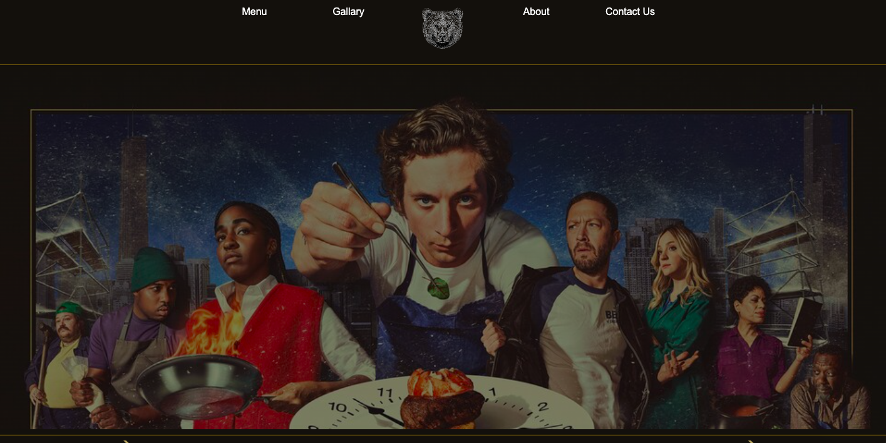

# Let It Rip



Let It Rip is a project inspired by the Hulu TV series "The Bear." This website is designed to showcase a fictional restaurant, drawing inspiration from the themes and aesthetics of the show.

## Table of contents

- [Project Overview](#projectoverview)
- [Features](#features)
- [Project Structure](#projectstructure)
- [Getting Started](#gettingstarted)
- [Roadmap](#roadmap)

## Project Overview

Let It Rip is a static website built using HTML, CSS, and JavaScript. It features a parallax effect, a carousel gallery, and personalized menus created with Canva.

The Website is deployed and accessible at https://anniejhwang.github.io/let-it-rip/.

## Features

### Parallax Effect

The website incorporates a parallax effect to add depth and visual interest. As users scroll, background images move at different speeds, creating a dynamic and immersive experience.

### Carousel Gallery

A carousel gallery is implemented to showcase images related to the restaurant's ambiance and dishes. Users can navigate through the gallery to explore different visuals associated with The Bear.

### Personalized Menus from Canva

The restaurants menu is designed using Canva. Canva was employed to create visually appealing and customized menus, reflecting the unique character of the TV series.

## Project Structure

- **index.html:** The main HTML file containing the structure of the website.
- **styles.css:** The CSS file responsible for styling the HTML elements.
- **script.js:** The JavaScript file for handling interactive features, such as the carousel effect.

## Getting Started

1. Clone the repository to your local machine.
   ```bash
   git clone https://github.com/your-username/the-bear-restaurant-website.git
   ```

## Roadmap

- Accessibility Improvements: Conduct an accessibility audit to make necessary adjustments to enhance the website's accessibility for users with disabilities.
- Dynamic Content: Integrate a back-end server or explore JavaScript framworks for dynamic content rendering.
- Advanced Animations: Incorporate advanced animations and transitions to elevate the overall visual appeal and engagement.
- Hidden Easter Eggs: Easter eggs for users to discover. Ideas include a secret/off menu items.

## Credits

Let It Rip was developed by Annie Hwang. The static website uses Canva to create personalized menu's for the fictional restaurant.
